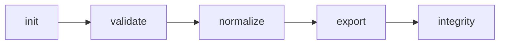

# webconfig

[](https://github.com/Iniciativas-Alexendros/webconfig/actions/workflows/ci.yml)
[](https://github.com/Iniciativas-Alexendros/webconfig/releases)

[](LICENSE)

Herramienta de línea de comandos (CLI) para **crear, validar, normalizar y exportar** paquetes de sitios web en el formato **site.bundle v1.0.0**.

Este formato se usa para describir de forma estandarizada cómo debe construirse un sitio web: qué páginas tiene, cómo está organizada cada página, qué contenido muestra en cada idioma y cómo debe posicionarse en los buscadores.

La herramienta permite a un sistema de producción (por ejemplo, un generador de webs visuales o una tubería de integración continua) comprobar que un sitio está bien definido y empaquetarlo de forma reproducible.

---

## TL;DR 30s

```bash
nvm use && npm ci && npm run build
node dist/cli.js init ./mi-sitio --name "Mi Sitio"
node dist/cli.js validate ./mi-sitio --ds ./ds-catalog.yaml
```

Flujo típico: `init` → `validate` → `normalize` → `export` → `integrity`.



**Ref:** [CHANGELOG](CHANGELOG.md) · [DECISIONS](DECISIONS.md) · [ds-catalog.example.yaml](ds-catalog.example.yaml) · [schemas/](schemas/) · [CONTRIBUTING](CONTRIBUTING.md)

---

## ¿Qué hace webconfig?

En palabras sencillas, webconfig te ofrece cinco operaciones:

| Comando | Qué hace |
|---------|----------|
| `init` | **Crea** un sitio starter válido desde cero. |
| `validate` | **Comprueba** que un sitio está bien formado y no tiene errores. |
| `normalize` | **Ordena** los archivos para que tengan siempre el mismo formato. |
| `export` | **Empaqueta** el sitio en un único archivo `.tar.gz` (reproducible). |
| `integrity` | **Calcula** huellas digitales (hashes) para verificar que nadie alteró los archivos. |

Todas estas operaciones son **deterministas**: si ejecutas el mismo comando dos veces sobre los mismos datos, obtienes exactamente el mismo resultado. Esto es importante para que los sistemas automáticos puedan comparar versiones y detectar cambios reales (y no simples diferencias de formato).

---

## Requisitos

Para usar webconfig necesitas:

- **Node.js** versión 20 o superior (`nvm use` — hay `.nvmrc` con Node 22).
- El proyecto usa **ESM** (`"type": "module"`), es decir, módulos modernos de JavaScript/TypeScript.

---

## Instalación

```bash
nvm use
npm ci
npm run build
```

Tras compilar, el programa queda disponible en `dist/cli.js`. También puedes instalarlo globalmente:

```bash
npm link
```

Y a partir de entonces podrás usar el comando `webconfig` directamente en tu terminal.

Comprobaciones habituales antes de un PR:

```bash
npm run typecheck:all && npm run lint && npm run format:check
npm run build && npm test && npm run verify:fixtures
npm run tokens:build && npm run tokens:check && npx playwright test && npm run ds:build
```

---

## Design System (tokens OKLCH + Showcase en browser)

Sistema de diseño tokenizado desde colores hasta componentes:

- **Fuente:** `tokens/*.tokens.json` en formato **W3C DTCG** (`$value/$type/$description`), color autorado en **OKLCH** (CSS Color 4). Metodología CSS **CUBE + Every Layout**, sin frameworks JS.
- **Build:** `npm run tokens:build` genera `dist-tokens/{css,variables.css · ts/tokens.ts · json/tokens.json}` + fallback hex sRGB para navegadores sin `oklch()`. `npm run tokens:check` verifica contraste **WCAG 2.2 AA + APCA** y cobertura 1:1.
- **GUI:** `npm run ds:dev` abre el Showcase (Vite): `/` tabla de tokens con swatches y toggle light/dark/auto · `/#/componentes` los 18 componentes de `ds-catalog.example.yaml` · `/#/preview/home` render del bundle golden + selector de fixtures inválidas.
- **E2E/visual:** `npx playwright test` (chromium: 3 rutas sin errores, toggle de tema, 18 tarjetas, preview golden, screenshots light/dark, checks a11y). Baseline en `tests/ds/showcase.e2e.spec.ts-snapshots/`.
- **Compat:** el formato `site.bundle v1.0.0` no cambia (`schemas/` congelado). Extensión opt-in documentada en `docs/adr/ds-tokens-v1.1-proposal.md`.

---

## Comandos

### 0. `webconfig init <carpeta> [opciones]`

Crea un sitio starter válido desde cero (composición, contenido es/en, SEO, logo, `manifest.yaml` con `integrity`, y `../ds-catalog.yaml` mínimo de 4 componentes si no existe).

**Opciones:**

| Opción | Descripción |
|--------|-------------|
| `--name <nombre>` | Nombre del sitio (por defecto, el nombre de la carpeta). |
| `--force` | Sobrescribe una carpeta existente no vacía. |

**Ejemplo:**

```bash
node dist/cli.js init ./mi-sitio --name "Mi Sitio"
node dist/cli.js validate ./mi-sitio --ds ./ds-catalog.yaml
```

### 1. `webconfig validate <paquete> [opciones]`

Comprueba si un sitio es válido. Acepta tanto una carpeta como un archivo `.tar.gz`.

**Opciones:**

| Opción | Descripción |
|--------|-------------|
| `--ds <ruta>` | Ruta al catálogo de componentes `ds-catalog.yaml`. Si no se indica, se busca en la carpeta superior al paquete. |
| `--strict` | Además de los errores, trata los avisos como fallos (salida con código 1). |
| `--json` | Imprime el resultado en formato JSON, pensado para que otras herramientas lo lean fácilmente. |

**Códigos de salida:**

| Código | Significado |
|--------|-------------|
| `0` | El sitio es válido (sin errores, o solo avisos si no usas `--strict`). |
| `1` | El sitio tiene errores (o avisos si usas `--strict`). |

**Ejemplo:**

```bash
webconfig validate ./mi-sitio --ds ./ds-catalog.yaml --json
```

Salida `--json` (fail-closed: ante un error de carga devuelve JSON con `valid: false` y salida 1):

```json
{
  "errors": [],
  "warnings": [{ "code": "I18N_002", "severity": "warning", "file": "content/en/home.json", "message": "#/intro resolved via fallback to es" }],
  "valid": true
}
```

### 2. `webconfig normalize <carpeta> [opciones]`

Ordena y da formato canónico a los archivos YAML y JSON de un sitio. Garantiza que las claves aparezcan siempre en orden alfabético y con una indentación fija.

**Opciones:**

| Opción | Descripción |
|--------|-------------|
| `--check` | Solo comprueba si los archivos ya son canónicos. Si no lo son, termina con código 1 y no modifica nada. |
| `--write` | Modifica los archivos directamente, normalizándolos en su lugar. |

**Ejemplos:**

```bash
webconfig normalize ./mi-sitio --write
webconfig normalize ./mi-sitio --check
```

> **Consejo:** usa `--check` en tu tubería de integración continua. Si alguien sube un cambio con el formato desordenado, la comprobación fallará y se sabrá antes de llegar a producción.

### 3. `webconfig export <paquete> <salida>`

Empaqueta un sitio en un archivo `.tar.gz` **reproducible**: el mismo sitio siempre produce exactamente el mismo archivo.

**Características del empaquetado:**

- Los archivos se ordenan por ruta.
- Las fechas de modificación se fijan en cero (época Unix).
- La compresión gzip no incluye marca de tiempo.
- Los propietarios (uid/gid) son fijos.

**Ejemplo:**

```bash
webconfig export ./mi-sitio ./mi-sitio.tar.gz
```

### 4. `webconfig integrity <carpeta>`

Calcula una huella digital (hash SHA-256) de cada archivo del sitio, más un **hash global** que resume todos los archivos. Es útil para verificar que el contenido no ha sido alterado entre el desarrollo y la publicación.

**Ejemplo:**

```bash
webconfig integrity ./mi-sitio
```

**Salida:**

```text
Global hash: 9f2c…e1
Files: 18
a1b2…c3  content/en/home.json  (412 bytes)
…
```

El bloque `integrity` del `manifest.yaml` se valida con `INTEGRITY_001/002` (`manifest.yaml` está excluido del conjunto hasheado).

---

## Troubleshooting

| Síntoma | Causa probable | Qué hacer |
|---------|----------------|-----------|
| `Failed to load DS catalog` + `COMP_001` | `--ds` no apunta a un `ds-catalog.yaml` existente | Pasa `--ds ./ds-catalog.yaml` explícito o coloca el catálogo en la carpeta superior al paquete. |
| Avisos `I18N_002/ASSET_002/SEO_002/CRYPTO_001` no fallan | Por defecto solo los errores dan salida 1 | Usa `--strict` para que los avisos también fallen. |
| `validate --json` ante un paquete inexistente | Error de carga fail-closed | Lee el JSON de stdout (`valid: false`, `SYNTAX_ERROR`) en vez de stderr. |
| `normalize --check` falla en CI | Archivos no canónicos | Ejecuta `normalize --write` en local y commitea el resultado. |

---

## Códigos de error

Cuando webconfig encuentra un problema, lo identifica con un código concreto. Son **27 códigos** (26 reglas + `SYNTAX_ERROR` fail-closed de errores de carga; los fallos de esquema AJV se reportan como `SYNTAX_<keyword>`). Cada código tiene una **severidad**:

- **error** → el sitio no es válido y no debería publicarse.
- **warning (aviso)** → se puede publicar, pero conviene revisarlo (con `--strict` también falla).

| Código | Severidad | Descripción (en lenguaje claro) |
|--------|-----------|--------------------------------|
| `PARENT_001` | error | Un componente apunta a un componente padre que no existe. |
| `PARENT_002` | error | Un componente apunta a un padre que no es de tipo "layout" (diseño). |
| `CONTENTREF_001` | error | Una referencia de contenido apunta a una página que no existe. |
| `CONTENTREF_002` | error | La sintaxis de una referencia de contenido es incorrecta. |
| `CONTENTREF_003` | error | La clave buscada dentro de un archivo de contenido no se encuentra. |
| `I18N_002` | warning | Falta contenido en un idioma; se usará el idioma por defecto. |
| `COMP_001` | error | El tipo de componente no existe en el catálogo de diseño (DS catalog). |
| `COMP_002` | error | Las propiedades de un componente no coinciden con las definidas en el catálogo. |
| `A11Y_001` | error | Una imagen no tiene texto alternativo (`alt`). |
| `PRICE_001` | error | Un precio no tiene importe, moneda o periodo. |
| `ICON_001` | error | Un icono no está en la lista permitida ni es un pictograma Unicode válido. |
| `ASSET_001` | error | Se referencia un archivo (imagen, logo...) que no existe en el paquete. |
| `ASSET_002` | warning | Hay un archivo en el paquete que no se usa en ninguna parte. |
| `RICHTEXT_001` | error | Se detectaron etiquetas HTML en un campo de texto enriquecido. |
| `LINK_001` | error | Un enlace interno apunta a una página que no existe. |
| `LINK_002` | error | Un enlace externo usa `http://` en lugar de `https://`. |
| `LINK_003` | error | Un enlace con ancla (`#`) apunta a un identificador que no existe. |
| `SEO_001` | error | El título o la descripción SEO supera la longitud recomendada. |
| `SEO_002` | warning | El dato estructurado `jsonLd` no tiene `@context` o `@type`. |
| `SECRET_001` | error | Se detectó algo parecido a una clave secreta (API key, token, clave privada). |
| `MANIFEST_001` | error | El manifiesto referencia un `site.config.yaml` que no existe. |
| `MANIFEST_002` | error | La versión del paquete en el manifiesto no coincide con la esperada. |
| `INTEGRITY_001` | error | El hash de un archivo no coincide con el esperado. |
| `INTEGRITY_002` | error | El hash global del paquete no coincide con el esperado. |
| `CRYPTO_001` | warning | Se detectó un patrón que podría ser una contraseña o clave en un contexto dudoso. |
| `STRUCT_001` | error | Falta un directorio obligatorio (`composition/` o `content/`). |
| `SYNTAX_<keyword>` | error | Fallo de esquema AJV (p. ej. `SYNTAX_TYPE`, `SYNTAX_REQUIRED` en `site.config.yaml`). |
| `SYNTAX_ERROR` | error | Fallo de carga/parseo fail-closed (bundle inexistente, tar corrupto, YAML/JSON inválido). |

---

## Cómo añadir un componente al catálogo de diseño (DS catalog)

El catálogo de diseño (`ds-catalog.yaml`) describe qué componentes existen y cómo deben usarse. Añadir un componente es sencillo:

1. Abre tu archivo `ds-catalog.yaml` (o crea uno).
2. Añade una nueva entrada de componente con estos campos:
   - `id`: identificador único del componente.
   - `name`: nombre legible para las personas.
   - `category`: **obligatorio**; uno de estos valores: `layout`, `nav`, `content`, `form`, `media`.
   - `description`: descripción opcional.
   - `propsSchema`: esquema JSON que define las propiedades del componente.
3. Si el componente usa iconos, define la propiedad `icon` con una lista `enum` de nombres permitidos.
4. Si el componente sirve como contenedor de diseño, debe tener `category: "layout"` (así se valida correctamente la relación padre-hijo).

**Ejemplo:**

```yaml
components:
  - id: "mi-componente"
    name: "Mi Componente Personalizado"
    category: "content"
    description: "Un componente de contenido personalizado"
    propsSchema:
      type: object
      properties:
        title:
          type: string
        icon:
          type: string
          enum: ["estrella", "corazon", "usuario"]
      required: ["title"]
```

> **Recuerda:** el campo `category` es obligatorio. webconfig lo usa para saber qué componentes son de diseño (`layout`) y, en ningún caso, se fía de prefijos en el nombre del componente.

Para un starter mínimo de 4 componentes (`header`, `hero`, `footer`, `text-block`), usa `webconfig init ./mi-sitio`: genera `../ds-catalog.yaml` si no existe. El ejemplo completo de 18 componentes vive en [`ds-catalog.example.yaml`](ds-catalog.example.yaml).

---

## Salida determinista

Todas las operaciones de webconfig producen resultados **exactamente reproducibles**:

- `normalize` genera siempre el mismo contenido, sin importar el orden en que se escribieron las claves.
- `export` genera siempre el mismo archivo `.tar.gz` para el mismo sitio.
- `integrity` calcula hashes estables y comparables.

Esto convierte a webconfig en una herramienta fiable para sistemas automáticos: lo que se valida hoy será idéntico a lo que se valide mañana si el sitio no cambia.

---

## Estructura de un paquete site.bundle

Para entender bien cómo funciona webconfig, conviene conocer la estructura de un paquete:

```
mi-sitio/
├── manifest.yaml              # Ficha del paquete (nombre, versión, fechas)
├── site.config.yaml           # Configuración general (idiomas, tema, navegación)
├── composition/               # Diseño de cada página (componentes y orden)
│   ├── home.yaml
│   ├── servicios.yaml
│   └── contacto.yaml
├── content/                   # Contenido por idioma
│   ├── es/                    #   Español
│   │   ├── home.json
│   │   └── ...
│   ├── en/                    #   Inglés
│   │   └── ...
│   └── seo/                   #   Datos de posicionamiento por idioma
│       ├── es/
│       └── en/
└── assets/                    # Archivos estáticos (imágenes, logos)
    ├── brand/
    └── media/
```

webconfig revisa cada parte y comprueba que todo encaje: que las páginas del diseño existan, que el contenido cubra los idiomas declarados, que las imágenes existan, que los enlaces sean correctos, etc.

---

## Contrato de versión

webconfig separa **dos versiones que no debes confundir**:

| Qué | Dónde vive | Quién la gestiona |
|-----|-----------|-------------------|
| **Versión de la herramienta** (webconfig) | `package.json` → `version` | semantic-release (bumps automáticos en cada release) |
| **Versión del formato** site.bundle | `schemas/` y `schema_compat` | Decisión manual únicamente (nadie la toca automáticamente) |

- El **formato** site.bundle está **congelado en v1.0.0**. No cambia salvo decisión manual explícita, y cualquier cambio requiere una propuesta escrita en `DECISIONS.md`.
- La **herramienta** se versiona de forma independiente (`v1.0.x`, `v1.1.x`, ...): puedes actualizar webconfig sin que eso altere el formato que produce o valida.
- Los **tags de formato** (puntos de anclaje como `v1.0.0`) son la referencia para los consumidores del formato: un paquete site.bundle se identifica por su versión de formato, no por la versión del CLI que lo generó.

---

## Licencia

MIT